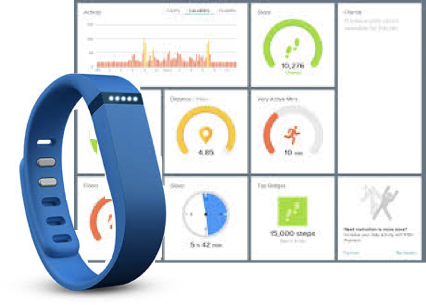

class: inverse, center, middle
background-image: url(https://cdn2.vectorstock.com/i/1000x1000/49/56/red-curtains-on-brick-wall-background-vector-21054956.jpg)
background-size: 1050px
background-position: 50% 12%

<p class="white" style="font-size:100px" align=center>
Welcome to<br>Stat 480
</p>

```{r setup, include=FALSE}
options(htmltools.dir.version = FALSE)
#xaringan::inf_mr(cast_from = '..')
```


---
## What is this course about?

Data Acquisition  
   - data ingestion: flat files, data bases, web sites, other (binary) sources  
   
   - ethical issues

<br/>

Data Exploration  
  - numerical and graphical summaries  
  
  - types of graphics and good visualization practices  
  
  - (simple) modeling  
  
---
## What is this course about? (cont'd)
    
Data Management  
  - Pipeline for data analysis: filtering, transformation, aggregation
    
  - data (re-)shaping
    
  - normal forms of data

<br/>
Communicating Findings
  - writing reports 
  
  - web-based applets

<br/>
Reproducibility/Repeatability of Findings
    
---
## Data comes in many formats

... as sound 


... as image


... in a monitoring device


---
#### <br/>

```{r}
library(tuneR)
ilr_class <- readWave("data/i-like-r.wav")
str(ilr_class)
```

```{r, echo =FALSE, cache = TRUE, message=FALSE, warning = FALSE, fig.height = 3, fig.width = 5}
ilr_df <- data.frame(left=ilr_class@left, right=ilr_class@right)
ilr_df$time <- 1:nrow(ilr_df)
library(tidyverse)
ilr_df %>% ggplot(aes(time, right)) + geom_line()
```

---
#### <br/>

```{r, message=FALSE}
library(jpeg)
img <- readJPEG("data/imgres.jpg")
str(img)
```

```{r, echo = FALSE, message = FALSE, cache= TRUE, fig.width=9, fig.height=3}
img_df <- data.frame(expand.grid(y = 1:dim(img)[1], x = 1:dim(img)[2]))
img_df$red <- as.numeric(img[,,1])
img_df$green <- as.numeric(img[,,2])
img_df$blue <- as.numeric(img[,,3])
p1 <- qplot(data=img_df, geom="tile", x =x, y=-y, fill = red) + xlab("") +ylab("") + scale_fill_gradient(low="white", high = "red") + theme(legend.position="none")
p2 <- qplot(data=img_df, geom="tile", x =x, y=-y, fill = green) + xlab("") +ylab("") + scale_fill_gradient(low="white", high = "green")+ theme(legend.position="none")
p3 <- qplot(data=img_df, geom="tile", x =x, y=-y, fill = blue) + xlab("") +ylab("") + scale_fill_gradient(low="white", high = "blue")+ theme(legend.position="none")
library(gridExtra)
grid.arrange(p1,p2,p3, nrow=1)
```

... what kind of birds are [these](http://www.theradzoo.com/meet-the-animals/birds/rainbow-lorikeet/)?

---
class: center, middle

# ... we will be using R for that!

---
## R is ...


- **Free** to use, **open source** so you can see what code is doing to your data 

- **Extensible**: Over 10000 user contributed add-on packages currently on CRAN! Bioconductor has more than 1300 packages, and many researchers provide packages through github.  

- **Powerful**  
    - With the right tools, get more work done, faster.

- **Flexible**  
    - Not a question of *can*, but *how*.  

- (with python) the most commonly used data science language (see [kdnuggets](http://www.kdnuggets.com/2017/05/poll-analytics-data-science-machine-learning-software-leaders.html) survey)  

```{r, eval = FALSE, echo = FALSE}
devtools::install_github("metacran/crandb")
pkgs <- crandb::list_packages(limit = 999999)
length(pkgs)
# [1] 12004
```

---
## at the end of the course you will ...

- be able to deal with complex, messy, real data  

- have gained familiarity with basic data collection, storage and manipulation  

- fluently reshape data into the most convenient form for analysis or reporting  

- automate cleaning and analysis in R  

- use graphics to explore and understand data  

- communicate your findings in a reproducible form  

- program a shiny web-app  

---
## Syllabus

Full syllabus is available [from the course website](https://stat480-at-isu.github.io/syllabus.pdf).

#### Textbook (optional)

- Garrett Grolemund and Hadley Wickham: *[R for Data Science](http://r4ds.had.co.nz/)*  

- Hadley Wickham: *[Advanced R](https://adv-r.hadley.nz/)*  

- Yihui Xie: *Dynamic Documents with R and knitr*  

- additional readings  

#### Course website: 

- Materials, assignments, code: [https://stat480-at-isu.github.io/](https://stat480-at-isu.github.io/)  

- Canvas (for grades)  


---
## Grades

<table style="border-collapse:collapse;border-spacing:0;border-color:#ccc" class="tg"><tr><th style="font-family:Arial, sans-serif;font-size:20px;font-weight:normal;padding:10px 20px;border-style:solid;border-width:0px;overflow:hidden;word-break:normal;border-top-width:1px;border-bottom-width:1px;border-color:inherit;color:#333;background-color:#f0f0f0;text-align:left;vertical-align:top">Component</th><th style="font-family:Arial, sans-serif;font-size:20px;font-weight:normal;padding:10px 20px;border-style:solid;border-width:0px;overflow:hidden;word-break:normal;border-top-width:1px;border-bottom-width:1px;border-color:inherit;color:#333;background-color:#f0f0f0;text-align:left;vertical-align:top">Weight</th></tr><tr><td style="font-family:Arial, sans-serif;font-size:20px;padding:10px 20px;border-style:solid;border-width:0px;overflow:hidden;word-break:normal;border-top-width:1px;border-bottom-width:1px;border-color:inherit;color:#333;background-color:#fff;text-align:left;vertical-align:top">Homework</td><td style="font-family:Arial, sans-serif;font-size:20px;padding:10px 20px;border-style:solid;border-width:0px;overflow:hidden;word-break:normal;border-top-width:1px;border-bottom-width:1px;border-color:inherit;color:#333;background-color:#fff;text-align:left;vertical-align:top">30%</td></tr><tr><td style="font-family:Arial, sans-serif;font-size:20px;padding:10px 20px;border-style:solid;border-width:0px;overflow:hidden;word-break:normal;border-top-width:1px;border-bottom-width:1px;border-color:inherit;color:#333;background-color:#fff;text-align:left;vertical-align:top">Midterm</td><td style="font-family:Arial, sans-serif;font-size:20px;padding:10px 20px;border-style:solid;border-width:0px;overflow:hidden;word-break:normal;border-top-width:1px;border-bottom-width:1px;border-color:inherit;color:#333;background-color:#fff;text-align:left;vertical-align:top"></td></tr><tr><td style="font-family:Arial, sans-serif;font-size:20px;padding:10px 20px;border-style:solid;border-width:0px;overflow:hidden;word-break:normal;border-top-width:1px;border-bottom-width:1px;border-color:inherit;color:#333;background-color:#fff;text-align:left;vertical-align:top">Exam</td><td style="font-family:Arial, sans-serif;font-size:20px;padding:10px 20px;border-style:solid;border-width:0px;overflow:hidden;word-break:normal;border-top-width:1px;border-bottom-width:1px;border-color:inherit;color:#333;background-color:#fff;text-align:left;vertical-align:top">25%</td></tr><tr><td style="font-family:Arial, sans-serif;font-size:20px;padding:10px 20px;border-style:solid;border-width:0px;overflow:hidden;word-break:normal;border-top-width:1px;border-bottom-width:1px;border-color:inherit;color:#333;background-color:#fff;text-align:left;vertical-align:top">Project</td><td style="font-family:Arial, sans-serif;font-size:20px;padding:10px 20px;border-style:solid;border-width:0px;overflow:hidden;word-break:normal;border-top-width:1px;border-bottom-width:1px;border-color:inherit;color:#333;background-color:#fff;text-align:left;vertical-align:top">15%</td></tr><tr><td style="font-family:Arial, sans-serif;font-size:20px;padding:10px 20px;border-style:solid;border-width:0px;overflow:hidden;word-break:normal;border-top-width:1px;border-bottom-width:1px;border-color:inherit;color:#333;background-color:#fff;text-align:left;vertical-align:top">Final</td><td style="font-family:Arial, sans-serif;font-size:20px;padding:10px 20px;border-style:solid;border-width:0px;overflow:hidden;word-break:normal;border-top-width:1px;border-bottom-width:1px;border-color:inherit;color:#333;background-color:#fff;text-align:left;vertical-align:top"></td></tr><tr><td style="font-family:Arial, sans-serif;font-size:20px;padding:10px 20px;border-style:solid;border-width:0px;overflow:hidden;word-break:normal;border-top-width:1px;border-bottom-width:1px;border-color:inherit;color:#333;background-color:#fff;text-align:left;vertical-align:top">Report</td><td style="font-family:Arial, sans-serif;font-size:20px;padding:10px 20px;border-style:solid;border-width:0px;overflow:hidden;word-break:normal;border-top-width:1px;border-bottom-width:1px;border-color:inherit;color:#333;background-color:#fff;text-align:left;vertical-align:top">22.5%</td></tr><tr><td style="font-family:Arial, sans-serif;font-size:20px;padding:10px 20px;border-style:solid;border-width:0px;overflow:hidden;word-break:normal;border-top-width:1px;border-bottom-width:1px;border-color:inherit;color:#333;background-color:#fff;text-align:left;vertical-align:top">Presentation</td><td style="font-family:Arial, sans-serif;font-size:20px;padding:10px 20px;border-style:solid;border-width:0px;overflow:hidden;word-break:normal;border-top-width:1px;border-bottom-width:1px;border-color:inherit;color:#333;background-color:#fff;text-align:left;vertical-align:top">7.5%</td></tr></table>

---
## Homework

- weekly homework assignments.  

- homework assignments revise what we covered, plus synthesize some new information.  

- plan to spend about 3-4h on each assignment.  

---
## Midterm

- in-class programming exam.  

- open book, open note, open internet (no direct help from anyone else).  

- tentatively scheduled for ??.  

- sample exams will be posted as we get closer to the date.  

---
## Midterm project

- team-based project (4-5 members).  

- data exploration of a given data set.  

- your part: lay out data exploration, identify additional data and write up report of findings.  

- scope: 2-3 weeks of homework.  

---
## Final project

- no final exam.  

- team-based project (4-5 members).  

- several stages:  
    * identify topic and data set  
    * identify line of inquiry  
    * report findings in report or shiny app  
    * present your project in front of the class  

---
## Attendance

I expect you to attend class: there will be a substantial amount of time devoted to 'hands-on' examples on the computers. Make use of that time!

If you have to miss class, please 

(a) let me know ahead of time. 

(b) make sure to catch up with the material (e.g. have a designated note taker, talk to one of your team members, ... )

---
## Disability and Sickness

- Make sure to let me know (if you can, in advance, mini text is fine)

- If you have the flu - !!! Stay at home and take care of yourself !!!

- Keep on top of the weekly homework or you will get swamped!

---
## Lectures

- Electronic copy of the slides are available on the website

- But you’ll need to take your own notes!

- If you really want complete notes, organize a roster with others in the class

- Don't goof off on the computers!

- If you're bored, complain!

---
## Getting Help

There's lots of ways to get help in case you are stuck:

(1) Google is your friend! in particular, stackoverflow and R help are usually great resources,

(2) ask a team member,

(3) write email to the instructor with your question

---
## Asking a good question

#### ... is a learned and valuable skill!

Have a look at:

- stackoverflow's [Asking a good question](http://stackoverflow.com/help/how-to-ask)

- R's [Posting guidelines](https://www.r-project.org/posting-guide.html)

---
## What do you know already?

- excel?

- a programming language? 

- SAS? R? R markdown?

- database theory? what is a third normal form?

---
## What is this class about?

- very data centric

- I'd like to know what you are interested in

---
#### <br/>

#### **Sports** e.g. Baseball salaries and performance

#### **Crime data** (incl. type, time, place, demographics etc.)

#### **Health** e.g. fitness statistics, or disease rates, or health care costs

#### **Movies** e.g. ratings/box office revenues from IMDB

#### **Climate/Weather Data**

####  **Travel data**, e.g. US flights

####  **Environmental Data**: Pollution, Fuel Economy, CO2 Emissions (Carbon Footprint)

####  **Global Data**:  World Economy, Social indicators, ...

#### <br/>

#### **Anything else you can think of?**

---
## Now vote

Go to Wufoo Site to let me know your favorites and make suggestions:
http://heike.wufoo.com/forms/topics-of-interest/ 
