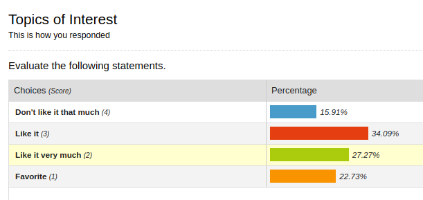

```{r setup, include=FALSE}
options(htmltools.dir.version = FALSE)
#xaringan::inf_mr(cast_from = '..')
library(tidyverse)
```

## ... this is what wufoo tells us



<br/>

... there's nine more of these charts ... which topic is the best?

---
<br/>

... this is what the raw data looks like ...

```{r, echo=FALSE}
topics <- read.csv("data/topics.csv")
topics <- topics %>% select(2:11)
head(topics)
```

---
## All topics in one

```{r echo=FALSE, fig.height=6, fig.width=10}
tlong <- topics %>% gather(topic, rating, 1:10)
tlong %>% 
  ggplot(aes(x = rating)) + geom_bar(aes(fill=rating)) +
  facet_wrap(~topic, ncol=5) +
  theme(legend.position="bottom")
```

---
## in the right order ...

```{r echo=FALSE, fig.height=6, fig.width=10}
tlong <- tlong %>% mutate(
  rating = factor(rating),
  rating = forcats::fct_relevel(rating, "Favorite", "Like it very much", "Like it"))

tlong %>% 
  ggplot(aes(x = rating)) + geom_bar(aes(fill=rating)) +
  facet_wrap(~topic, ncol=5) +
  theme(legend.position="bottom")
```

---
## better color scheme ...

```{r echo=FALSE, fig.height=6, fig.width=10}
library(RColorBrewer)
cols <- brewer.pal("RdBu", n = 8)

tlong %>% 
  ggplot(aes(x = rating)) + geom_bar(aes(fill=rating)) +
  facet_wrap(~topic, ncol=5) +
  theme(legend.position="bottom") +
  scale_fill_manual(values = cols[c(8,7,6,1)])
```

---
## a different picture ...

```{r echo=FALSE, fig.height=6, fig.width=10}
library(RColorBrewer)
cols <- brewer.pal("RdBu", n = 8)

tlong %>% 
  ggplot(aes(x = topic)) + geom_bar(aes(fill=rating)) +
  theme(legend.position="bottom") +
  scale_fill_manual(values = cols[c(8,7,6,1)])
```

---
## ... a different picture ...

```{r echo=FALSE, fig.height=6, fig.width=10}
tlong %>% 
  ggplot(aes(x = topic)) + geom_bar(aes(fill=rating)) +
  theme(legend.position="bottom") +
  scale_fill_manual(values = cols[c(8,7,6,1)]) +
  coord_flip()
```

---
## close to a final picture

```{r echo=FALSE, fig.height=6, fig.width=10}
tlong %>% 
  ggplot(aes(x = topic)) + geom_bar(aes(fill=rating)) +
  theme_light() +
  theme(legend.position="bottom", axis.text.y = element_blank()) +
  scale_fill_manual(values = cols[c(8,7,6,1)]) +
  coord_flip() +
  scale_y_reverse() +
  geom_text(aes(x = topic, label = topic), 
            y = -nrow(topics)+1, colour = "white", hjust=0)
```

---
##  THIS is what you said:

```{r echo=FALSE, fig.height=6, fig.width=10}
tlong <- tlong %>% 
  mutate(
        topic = reorder(topic, rating, FUN=function(x) 
          sum(x %in% c("Favorite"))),
        topic = reorder(topic, rating, FUN=function(x) 
          sum(x %in% c("Favorite", "Like it very much"))),
    topic = reorder(topic, rating, FUN=function(x) 
          -sum(x == "Don't like it that much"))
  )
tlong %>% 
  ggplot(aes(x = topic)) + geom_bar(aes(fill=rating)) +
  theme_light() +
  theme(legend.position="bottom", axis.text.y = element_blank()) +
  scale_fill_manual(values = cols[c(8,7,6,1)]) +
  coord_flip() + 
  scale_y_reverse() +
  geom_text(aes(x = topic, label = topic), 
            y = -nrow(topics)+1, colour="white", hjust=0)
```


