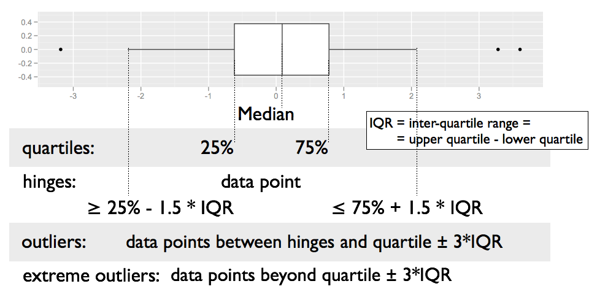

```{r setup, include=FALSE}
options(htmltools.dir.version = FALSE, cache = TRUE)
#xaringan::inf_mr(cast_from = '..')
```

## Plan for answers

1. Explore how one (or more) variables are distributed: 
  - barchart or histogram

2. Explore how two variables are related:  
  - scatterplot, boxplot, tile plot

3. Explore how two variables are related, conditioned on other variables:  
  - facetting, color & other aesthetics

<br/>

> Look at 3 next, then come back to 1 and 2.

---
## Getting ready

Load libraries:

```{r}
library(ggplot2) 
# not found? run install.packages("ggplot2")

library(classdata) 
# not found? run devtools::install_github("haleyjeppson/classdata")
```

<br/><br/>
... not able to install devtools or the classdata package?

```{r}
fbiwide <- read.csv("https://raw.githubusercontent.com/Stat480-at-ISU/materials-2020/master/02-r_intro/data/fbiwide.csv")
```

---
class: inverse, center, middle
# Facetting

---
## Facetting

Can facet to display plots for different subsets: `facet_wrap`, `facet_grid`

```{r fig.height=8, fig.width=16, message=FALSE}
ggplot(data=fbiwide, aes(x = Year, y = Murder)) + geom_point() + facet_wrap(~State)
```

---
## Setup of `facet_wrap` and `facet_grid`

- `facet_grid` has formula specification: `rows ~ cols`

- `facet_wrap` has specification `~ variables` 

- multiple variables (in either specification) are included in the form of a sum  
  - i.e. `rowvar1 + rowvar2 ~ colvar1+ colvar2`

- no variable (in `facet_grid`) is written as `.`  
  - i.e. `rowvar ~ .` are plots in a single column.

```{r}

```

---
class: inverse
## Your turn 

Use the `fbiwide` data from the package `classdata` for this your turn.

- Plot the number of car thefts by year for each state (facet by state).

- The numbers are dominated by the number of thefts in California, New York, and Texas. Use a log-scale for the y-axis. Does that help?

- Another approach to fix the domination by CA, TX and NY: Read up on the parameters in `facet_wrap` to find a way to give each panel its own scale. Comment on the difference in the results.

---
## Facets vs. aesthetics?

- Will need to experiment as to which one answers your question/tells the story best

- Rule of thumb: comparisons of interest should be close together

---
class: inverse, center
## Boxplots

```{r, echo=FALSE, warning=FALSE, fig.width = 16, fig.height = 10}
ggplot(data = fbi, aes(x = Type, y = log10(Count))) + geom_boxplot() + coord_flip()
```

---
## Boxplot definition

- definition by J.W. Tukey (1960s, EDA 1977)



---
## Boxplots

- are used for group comparisons and outlier identifications

- usually only make sense in form of side-by-side boxplots.

- `geom_boxplot` in ggplot2 needs `x` and `y` variable  
  - `y` is measurement,  
  - `x` is categorical  

<br/>

  ```
  ggplot(data = fbi, aes(x = Type, y = log10(Count))) +
    geom_boxplot() + 
    coord_flip()
  ```

---
class: inverse
## Your turn 


- Using ggplot2, draw side-by-side boxplots of the number of robberies by state. Use a log transformation on y and compare results.

- **Stretch goal:** Compare rates of robberies by state, i.e. adjust robberies by the state population. Then plot side-by-side boxplots. 

---
## Boxplots

**Pros**  

  - Symmetry vs Skewness
    
  - Outliers
    
  - Quick Summary
    
  - Comparisons across multiple Treatments (side by side boxplots)

<br/>

**Cons**

  - Boxplots hide multiple modes and gaps in the data


---
class: inverse, center, middle
# Univariate plots
## Histograms & barcharts

---
## Histograms

```{r, fig.width=8, fig.height=6}
ggplot(fbiwide, aes(x = Motor.vehicle.theft)) + 
  geom_histogram(binwidth = 5000) +
  ggtitle("binwidth = 5000")
```

---
## Histograms

```{r, fig.width=8, fig.height=6}
ggplot(fbiwide, aes(x = Motor.vehicle.theft)) + 
  geom_histogram(binwidth=1000) +
  ggtitle("binwidth = 1000")
```

---
## Barchart

```{r fig.width=8, fig.height=6}
ggplot(fbi, aes(x = Type)) + 
  geom_bar(aes(weight= Count)) +
  coord_flip()
```

---
## Histograms and barcharts

What do we look for?

- Symmetry/Skewness
- Modes, Groups  (big pattern: where is the bulk of the data?)
- Gaps & Outliers (deviation from the big pattern: where are the other points?)


For the histogram, always choose the binwidth consciously

In a barchart, choose the order of the categories consciously (later)

---
class:inverse
## Your turn 

- Use the `fbi` data set to draw a barchart of the variable `Violent Crime`.  

- Make the height of the bars dependent on the number of reports (use `weight`).

- Then facet by type (does the result match your expectation? good! get rid of facetting). 

- Color bars by `Type`. 

- Use the `fbi` data set to draw a histogram of the number of reports. 

- Facet by type, make sure to use individual scales for the panels.

---
## More on `ggplot2`

- reference/document: http://ggplot2.tidyverse.org/reference/

- RStudio cheat sheet for [ggplot2](https://www.rstudio.com/wp-content/uploads/2015/03/ggplot2-cheatsheet.pdf)

