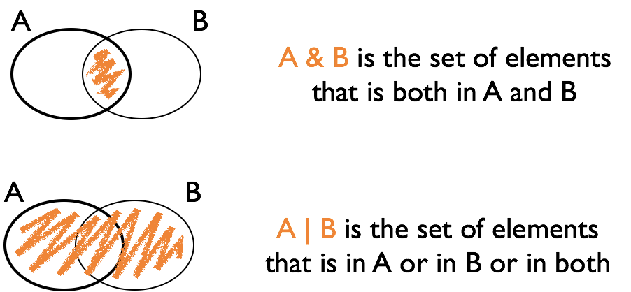

```{r setup, include=FALSE}
options(htmltools.dir.version = FALSE)
#xaringan::inf_mr(cast_from = '..')
```
class: inverse, middle, center
# Logical vectors

---
## Logical vectors

- Vectors consisting of values `TRUE` and `FALSE`

- Very important!

- Usually created with a logical comparison

- `<, >, ==, !=, <=, >=`

- `x %in% c(1, 4, 3, 7)`

- `subset` or `dplyr::filter`

---
## Logical expressions

- `&` and `|` are the logical *and* and *or*

- `!` is the logical negation

- use parentheses () when linking expressions to avoid mis-interpretation

---
## Logical Operations

<br/><br/>

 

---
class: yourturn
.center[
# Your turn 
]

Define vector `a` to be `a <- c(1,15, 3,20, 5,8,9,10, 1,3)`

<br/>

Find the expression for the logical vector that is TRUE where `a` is:

- less than 20

- squared value is at least 100 or less than 10

- equals 1 or 3

- even 

  - **Hint**: have a look at the help for the operator `%%` 
      ```
      ?`%%`
      ```
  

---
class: inverse, center, top
background-image: url(https://github.com/allisonhorst/stats-illustrations/blob/master/rstats-artwork/dplyr_wrangling.png?raw=true)
background-size: 650px
background-position: 50% 85%
# filter {dplyr}

---
background-image: url(https://raw.githubusercontent.com/rstudio/hex-stickers/master/PNG/dplyr.png)
background-size: 150px
background-position: 90% 95%
## `filter {dplyr}`

`filter` is a command of package `dplyr`  
  - NOTE: the package `dplyr` is loaded by the package `tidyverse`

`filter(data, ...)` finds subset of `data` where conditions specified by logical expression in `...` are true,  
  - e.g. `filter(fbi, Year == 2014)`
`filter(fbi, Type == "Larceny.Theft", State %in% c("Iowa", "Minnesota"))`  

multiple expressions are combined by a logical and `&`  

Note that the command `subset` works very similarly.  

Caution! there is another function called `filter` in the `stats` package.

Use `::` to make sure you use the right one: `dplyr::filter`  

---
class: yourturn
.center[
# Your turn 
]

- Get a subset of all crimes in Iowa. Plot incidences/rates for one type of crime over time.

- Get a subset of all crimes in 2009. Plot the number or rate for one type of crime by state.

- Get a subset of the data that includes number of homicides for the last five years. Find the rate of homicides, extract all states that have a rate of greater than 90% of the rates across all states, and plot (Hint: `?quantile`).

---
## Useful commands

Number of records in a data set:

`nrow(dataset)`

Quantiles: 

`quantile(variable, probs=0.001, na.rm=T)`

Find all indices for which the expression is TRUE:

`which(logical variable)`

Retrieve index of maximum/minimum value:

`which.max(variable)`  
`which.min(variable)`


---
class: yourturn
.center[
# Your turn 
]
<!-- Use `learnr:: run_tutorial("logical", package="yourturns480")` to get to the answers for this your turn.   -->

Use the `fbi` data object to answer the following questions: 

- how many reports of burglaries are there for California?

- for any of the violent crimes, which state had the highest rate (and for which crime) in 2014? in 1961? 

Use the `fbiwide` data object to answer the following question: 

- in 2011, how many states had more vehicle thefts than robberies? (which states are those?)


---
## Updating elements in a vector

You can take a subset and update the original data:

```{r}
a <- 1:4
a

a[2:3] <- 0
a

replace(a, a == 0, -1)
```

Very useful in combination with logical subsetting

---
## Updating elements in a data set

data sets and their parts can be used as rhs of an assignment:

```{r}
library(classdata)

# introduces new variable in the data set fbiwide
fbiwide$murder.rate <- fbiwide$Murder/fbiwide$Population*100000

names(fbiwide)
```

if that variable exists before, it is being over-written/updated

---
class: yourturn
.center[
# Your turn 
]

The gapminder data we originally worked with is available [here](https://stat480-at-isu.github.io/materials-2020/01-collaborative_environment/data/gapminder-5060.csv). 

- `read.csv` helps you read the gapminder from the given link. Store the result in an object.

- What format does the object have?

- Replace the problematic value in life expectancy for Canada in 1957  by 69.96. 


---
## Resources

- reference/document: http://dplyr.tidyverse.org/reference/

- RStudio cheat sheet for [dplyr](https://github.com/rstudio/cheatsheets/raw/master/data-transformation.pdf)


- Artwork by [@allison_horst](https://twitter.com/allison_horst?ref_src=twsrc%5Egoogle%7Ctwcamp%5Eserp%7Ctwgr%5Eauthor)

