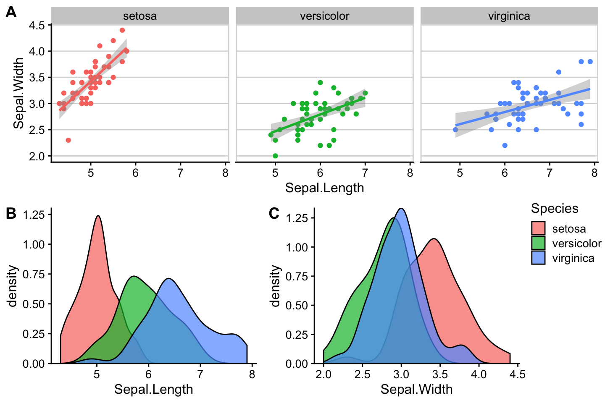
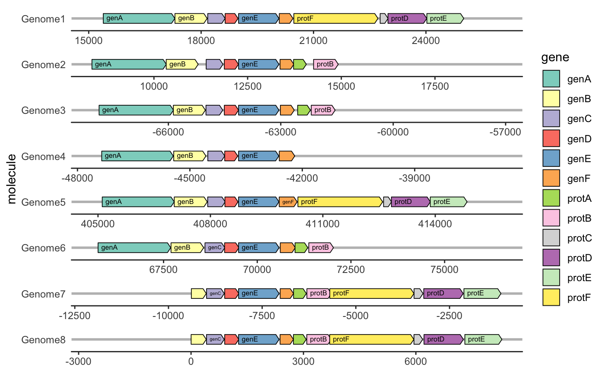
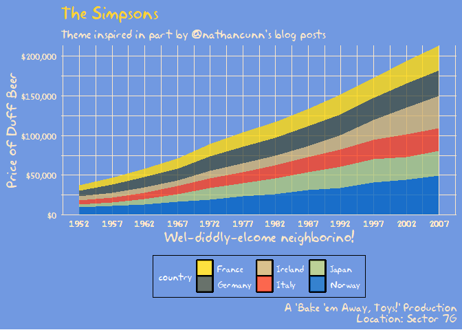

```{r setup, include=FALSE}
options(htmltools.dir.version = FALSE, echo = TRUE, cache = TRUE)
#xaringan::inf_mr(cast_from = '..') 
# install_github("hadley/emo")
library(emo)
emo_warn <- emo::ji("warning")
library(forcats)
```
class: inverse

## Visualizing factors 

<br/>

### Outline:

- review: factors in bar charts & factors in boxplots  

- use factors in aesthetics (`color`, `fill`, `shape`) or for facetting  

- always make sure that the order in factors is sensible!

- visualizing 2+ factors

---
## `r emo_warn` factors in boxplots `r emo_warn`

boxplots in ggplot2 only work properly if the x variable is a character or a factor:

```{r, echo=FALSE, warning=FALSE, message= FALSE}
library(ggplot2)
```

```{r, echo = TRUE}
twoyear <- dplyr::filter(gss_cat, year %in% c(2000, 2014))
```

.pull-left[
```{r, fig.width=4, fig.height = 4, message = FALSE, warning = FALSE, echo = TRUE}
ggplot(data = twoyear, 
       aes(x = year, y = tvhours)) + 
  geom_boxplot()
```
]
.pull-right[
```{r, fig.width=4, fig.height = 4, message = FALSE, warning = FALSE, echo = TRUE}
ggplot(data = twoyear, 
       aes(x = factor(year), y = tvhours)) + 
  geom_boxplot()
```
]

---
## `r emo_warn` factors in bar charts `r emo_warn`

A barchart can also provide us with a quick summary *provided* the <br> levels have values.

.pull-left[
```{r echo = TRUE}
ggplot(gss_cat, aes(race)) +
  geom_bar()
```
]

.pull-right[
```{r echo = TRUE}
ggplot(gss_cat, aes(race)) +
  geom_bar() +
  scale_x_discrete(drop = FALSE)
```
]

---
## `r emo_warn` factors for fill color `r emo_warn`

Area plots (e.g. histograms & barcharts) use aesthetic `fill` for showing colored areas & only factor variables can be mapped to `fill`

.pull-left[

```{r, message = FALSE, echo = TRUE, fig.height = 5, fig.width = 4}
ggplot(gss_cat, aes(x = marital)) + 
  geom_bar(aes(fill=year)) # nothing happens
```
]
.pull-right[
```{r echo = TRUE, fig.height = 5, fig.width = 4.5}
ggplot(gss_cat, aes(x = marital)) + 
  geom_bar(aes(fill=factor(year))) # not sensible, but works
```
]
---
## Ex: Survival on the Titanic

The object `titanic` is a table of a break down of survival of passengers and crew on board the Titanic by gender and age.

```{r, message = FALSE, echo = TRUE}
# devtools::install_github("haleyjeppson/classdata")
library(classdata)
data("titanic", package = "classdata")
head(titanic)
```

---
## Ex: Survival on the Titanic

Barcharts of all 4 variables: `Survived`, `Sex`, `Class`, and `Age`

.pull-left[
```{r, fig.width=3, fig.height = 2, echo = TRUE}
ggplot(titanic, aes(x = Survived)) + 
  geom_bar()

ggplot(titanic, aes(x = Sex)) + 
  geom_bar()
```
]
.pull-right[
```{r, fig.width=3, fig.height = 2, echo = TRUE}
ggplot(titanic, aes(x = Class)) + 
  geom_bar()

ggplot(titanic, aes(x = Age)) + 
  geom_bar()
```
]

---
## Ex: Survival on the Titanic

Add `fill = Survived` and `position="fill"` (not an aesthetic!)

.pull-left[
```{r, fig.width=3.9, fig.height = 2, echo = TRUE}
ggplot(titanic, aes(x = Survived, fill=Survived)) + 
  geom_bar(position="fill")

ggplot(titanic, aes(x = Sex, fill=Survived)) + 
  geom_bar(position="fill")
```
]
.pull-right[
```{r, fig.width=3.9, fig.height = 2, echo = TRUE}
ggplot(titanic, aes(x = Class, fill=Survived)) + 
  geom_bar(position="fill")

ggplot(titanic, aes(x = Age, fill=Survived)) + 
  geom_bar(position = "fill")
```
]

---
class: inverse, center, middle
# What if we have <br> more than 2 factors?

---
## 2+ factor variables

Besides facetting and position, use **mosaic plots**  

- there are [extension packages](https://www.ggplot2-exts.org/gallery/) for `ggplot2`, e.g. `ggmosaic`

<br/>
```{r, fig.width=9, fig.height = 6, message=FALSE, echo = FALSE}
library(ggmosaic)
ggplot(data = gss_cat)  + 
  geom_mosaic(aes(x = product(marital, race), fill=marital)) +
  labs(x = "Race", y = "Marital", title = "Breakdown of Marital Status by Race") 
```


---
## other `ggplot2` [Extension packages](https://www.ggplot2-exts.org/gallery/)

.pull-left[
gganimate
  


cowplot

]
.pull-right[
gggenes
  

<br/>
tvthemes

]

---
class: inverse, center, middle
# Returning to our example...

---
## Ex: Survival on the Titanic

... as a mosaic plot!

```{r, fig.width=10, fig.height = 4, message=FALSE, echo = TRUE}
library(ggmosaic)
ggplot(data = titanic)  + 
  geom_mosaic(aes(x = product(Sex), fill=Survived, weight=1)) +
  facet_grid(Age~Class)
```

---
class: yourturn
.center[
# Your turn 
]

For this your turn use the `titanic` object from the `classdata` package. 

- Draw a barchart of Gender. Interpret.

- Map survival to fill color in the barchart of Gender. Interpret.

- In the previous barchart change the `position` parameter to `"fill"`. Interpret.

- Read up on the `position` parameter in `?geom_bar`. Try out other options for `position`.

---
class: yourturn
.center[
# Your turn 
]

For this your turn use the `titanic` object from the `classdata` package:

```{r eval= FALSE}
# devtools::install_github("haleyjeppson/classdata")
library(classdata)
data("titanic")
```

- Draw a barchart of Gender. Interpret.

- Map survival to fill color in the barchart of Gender. Interpret.

- In the previous barchart change the `position` parameter to `"fill"`. Interpret.

- Read up on the `position` parameter in `?geom_bar`. Try out other options for `position`.

---
class: inverse, center, middle
# Why no pie charts?

---
background-image: url(https://miro.medium.com/max/1200/1*1IGNklnCANZPp2VD3mV9JQ.png)
background-size: 400px
background-position: 90% 40%
## Order of tasks - <br> easiest to hardest

.pull-left[
Cleveland and McGill (1984):

1. Position along a common scale
2. Positions along non-aligned scales
3. Length, direction, angle
6. Area
7. Volume, curvature
9. Shading, color saturation
]


---
## Implications for <br>drawing charts:  

- make main comparisons as easy as possible 
  - i.e. map as position along a common scale  
  
- Additional messages can be mapped on other aesthetics


