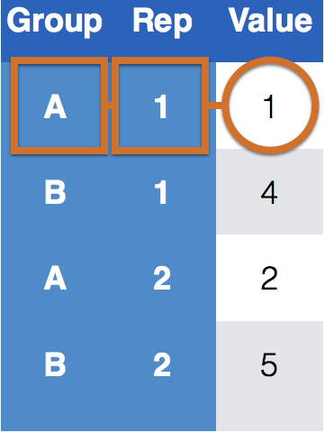

```{r setup, include=FALSE}
options(htmltools.dir.version = FALSE, echo = TRUE)
#xaringan::inf_mr(cast_from = '..') 
library(tidyverse)
data(french_fries, package="reshape2")
```
class: inverse, center, top
background-image: url(https://raw.githubusercontent.com/allisonhorst/stats-illustrations/master/rstats-artwork/tidyr_spread_gather.png)
background-size: 450px
background-position: 50% 70%
# The `tidyr` package

---
background-image: url(https://raw.githubusercontent.com/rstudio/hex-stickers/master/PNG/tidyr.png)
background-size: 120px
background-position: 92% 5%
## Tidy data
<br><br>
### &nbsp;&nbsp; Happy families are all alike; every unhappy  </br>  &nbsp;&nbsp; family is unhappy in its own way.  <br></br>  &nbsp;&nbsp; - Leo Tolstoy

<br><br>
**Resource**: follow along tidyr vignette 
- available as 
`vignette("tidy-data", package="tidyr")`  

- vignette is version of the [tidy data paper](https://www.jstatsoft.org/article/view/v059i10) with updated code

---
## Outline

<br>
What is tidy data?

Different sources of messiness

Key-Value pairs

`tidyr` functions: `pivot_longer()` and `pivot_wider()`

---
## Data is usually in a spreadsheet format, but ...

There are different ways to encode the same information:

.left-third[
.center[
<br>
Option #1
]
]
.right-two-thirds[
```{r echo = FALSE}
read.csv("data/preg.csv")
```
]

.left-third[
.center[
<br><br>
Option #2  
<br>
]
]

.right-two-thirds[
```{r echo = FALSE}
read.csv("data/preg2.csv")
```

]

.full[

Neither #1 nor #2 are "clean" versions of the data: observed information is part of the data structure; some implicit information is assumed

]
---
background-image: url("images/r4ds_data-science-tidyverse.png")
background-size: 600px
background-position: 30% 75%
## Why does this matter?

A "tidy" dataset, will be much easier to work with inside the tidyverse.


---
background-image: url(https://d33wubrfki0l68.cloudfront.net/6f1ddb544fc5c69a2478e444ab8112fb0eea23f8/91adc/images/tidy-1.png)
background-size: 900px
background-position: 50% 65%
## What is tidy data?


1. Each **variable** is one column.  

2. Each **observation** is one row.  

3. Each **value** must have its own cell.

???
A variable is a characteristic that is being measured, counted or described with data. Like: car type, salinity, year, population, or whale mass.

An observation is a single “data point” for which the measure, count or description of one or more variables is recorded. For example, if you are recording variables height, mass, and color of dragons, then each dragon is an observation.

A value is the recorded measure, count or description of a variable.

---
## Sources of Messiness

1. Column headers are values, not variable names.<br>
e.g. *treatmenta, treatmentb*  <br><br>
  
2. Multiple variables are stored in one column.<br>
e.g. *Fall 2015, Spring 2016* or *"1301 8th St SE, Orange City, Iowa 51041
(42.99755, -96.04149)", "2102 Durant, Harlan, Iowa 51537
(41.65672, -95.33780)"*  <br><br>

3. Multiple observational units are stored in the same table.  <br><br>

4. A single observational unit is stored in multiple tables.

---
## Clean version of the example


.left-third[
.center[
<br>
Option #1
]
]
.right-two-thirds[
```{r echo = FALSE}
read.csv("data/preg.csv")
```
]

.left-third[
.center[
<br><br>
Option #2
]
]

.right-two-thirds[
```{r echo = FALSE}
read.csv("data/preg2.csv")
```

]

.left-third[
.center[
<br><br>
"tidy"  
<br>
]
]

.right-two-thirds[
```{r echo = FALSE}
preg2 <- read.csv("data/preg2.csv")
preg2 %>% gather(key = patient, value = score, 2:4) %>% 
  mutate(patient = gsub("\\.", " ", patient))
```
]


---
## Clean version of the example

.left-third[
.center[
<br><br>
"tidy"  
<br>
]
]

.right-two-thirds[
```{r echo = FALSE}
preg2 <- read.csv("data/preg2.csv")
preg2 %>% gather(key = patient, value = score, 2:4) %>% 
  mutate(patient = gsub("\\.", " ", patient))
```
]


.full[
</br>
- `treatment` and `patient` uniquely describe a single row in the dataset.  

- `treatment` and `patient` are **key variables**,

- `score` is a **measurement variable**

- this makes `treatment-patient` and `score` a **key-value pair**

]
---
## Key-value pairs (KVP)
 
**Key-Value pairs** (KVP) - also *attribute-value*, *field-value*, *name-value*:
abstract data representation that allows a lot of flexibility  

One way of telling whether a data set is tidy is to check that all keys for a value are aligned in one row:  


.pull-left[
.center[
### Untidy data  


]
]
.pull-right[

### Tidy data  

  


]
---
## Tidying data: Plan of attack

Very few functions are needed for tidying data:

**Messy (1)**: `tidyr` functions `pivot_longer()` and `pivot_wider()`.  
- `pivot_longer(data, cols, names_to = "key", values_to = "value")`: take multiple columns and collapse into key-value pairs  
- `pivot_wider(data, names_from = name, values_from = key)`: spread a key-value pair across multiple columns.

**Messy (2)**: `tidyr` function `separate(data, col, into, sep = "[^[:alnum:]]+")`:  
- separate one column into multiple columns

**Messy (3)**: `dplyr` - some combination of the functions discussed previously  

**Messy (4)**: `dplyr` functionality `join` (and friends) to combine multiple data sets 

---
## French fries data

```{r}
data(french_fries, package="reshape2")
```

- data from sensory experiment conducted at Iowa State University in 2004

- investigators were interested in comparing effects of three different fryer oils on taste of fries

```{r}
french_fries %>% head()
```


---
## wide data $\rightarrow$ long data

```{r}
french_fries %>% head()
```

</br>
To tidy a dataset like this, we need to pivot the offending columns into a new pair of variables. To describe that operation we need three parameters:

1. The **set of columns** whose names are values, not variables. In this example, those are the columns `potato`, `buttery`, `grassy`, `rancid`, and `painty`.

2. The name of the variable to move the **column names** to. Here it is `scale`.

3. The name of the variable to move the **column values** to. Here it is `score`

Together those parameters generate the call to `pivot_longer()`:


---
background-image: url(images/pivot-longer-charts.png)
background-size: 900px
background-position: 35% 50%

### `pivot_longer(data, `<br>&nbsp;&nbsp;&nbsp;&nbsp;`cols = c("a1", "a2", "a3"),` <br>&nbsp;&nbsp;&nbsp;&nbsp;`names_to = "key",` <br>&nbsp;&nbsp;&nbsp;&nbsp;`values_to = "value")`

.footnote[
see full graphic [here](https://swcarpentry.github.io/r-novice-gapminder/fig/14-tidyr-fig3.png)
]

---
## Tidying the french fries data

```{r}
ff_long <- french_fries %>% 
  pivot_longer(cols = potato:painty, 
               names_to = "scale", 
               values_to = "score")
ff_long
```


---
## long data $\rightarrow$ wide data


---
background-image: url(images/pivot-wider-chart.png)
background-size: 900px
background-position: 35% 50%

### `pivot_wider(data, `<br>&nbsp;&nbsp;&nbsp;&nbsp;`values_from = value,` <br>&nbsp;&nbsp;&nbsp;&nbsp;`names_from = key)`


---
## Resources


- reference/document: http://tidyr.tidyverse.org/reference/

- RStudio cheat sheet for [tidyr](https://github.com/rstudio/cheatsheets/blob/master/data-import.pdf)

- Artwork by [@allison_horst](https://twitter.com/allison_horst?ref_src=twsrc%5Egoogle%7Ctwcamp%5Eserp%7Ctwgr%5Eauthor)

- Chart infrographics from [Software Carpentry](https://swcarpentry.github.io/r-novice-gapminder/14-tidyr/)


