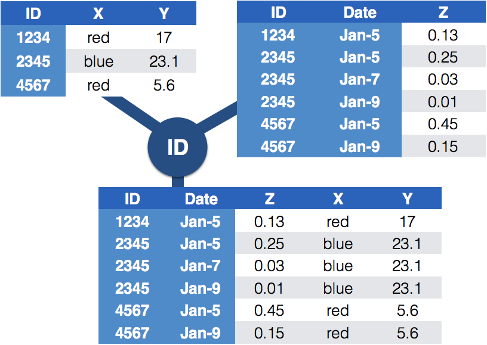

```{r setup, include=FALSE}
options(htmltools.dir.version = FALSE, echo = TRUE, eval = FALSE)
#xaringan::inf_mr(cast_from = '..') 
library(tidyverse)
```

## Messy (4)

<br>
**Messy (4)**: Values for a single observational unit are stored across multiple tables.


<br>
After data are normalized by splitting, we want to de-normalize again by *joining* datasets.

The variables used to connect each pair of tables are the **keys**.

---
## Relational data


It is not uncommon for a data analysis to involve many tables of data and you must combine them to answer the questions that you’re interested in.  

Collectively, multiple tables of data are called **relational data** because it is the relations, not just the individual datasets, that are important.

To work with relational data you need **verbs** that work with pairs of tables. There are three families of verbs designed to work with relational data:

1. **Mutating joins**, which add new variables to one data frame from matching observations in another.

2. **Filtering joins**, which filter observations from one data frame based on whether or not they match an observation in the other table.

3. **Set operations**, which treat observations as if they were set elements.


---
class: inverse, middle, center
# Joining data from different tables


---

## Example: Lahman package

Sean Lahman is a database journalist, who started databases of historical sports statistics, in particular, the Lahman database on baseball.

```{r}
library(Lahman)
LahmanData %>% head()
```

---
## Lahman database

The Lahman database consists of 24 data frames that are linked by `playerID`. 

This is clean, but not very readable. 

The `Master` table includes names and other attributes for each player. 

*Joining* multiple tables helps us to bring together (pieces of) information from multiple sources.

---
## Example: Hall of Fame

Who was inducted in the Hall of Fame in 2017?

```{r warning = FALSE, fig.height = 3.5}
HallOfFame %>% dplyr::filter(yearID == 2017) %>% head()
```

---
class: yourturn
# Your turn 

For this your turn use the `HallOfFame` and `Master` data from the `Lahman` package

- Identify all players who were inducted in the Hall of Fame in 2017, by filtering the `Master` data for their player IDs. 

---
## Joins: general idea



---
## Joins: more specific idea

- Data sets are joined along values of variables. 

- In `dplyr` there are several join functions: `left_join()`, `inner_join()`, `full_join()`, ...

- The differences between join functions are only visible if values in one set do not all have values in the other set.


---
## Example data

```{r}
df1 <- data.frame(id = 1:6, trt = rep(c("A", "B", "C"), rep=c(2,1,3)), value = c(5,3,7,1,2,3))
df1
```
</br>
```{r}
df2 <- data.frame(id=c(4,4,5,5,7,7), stress=rep(c(0,1), 3), bpm = c(65, 125, 74, 136, 48, 110))
df2
```    


---
## Mutating joins

A mutating join allows you to combine variables from two tables. 

We first match observations by their keys, then copy across variables from one table to the other.

There are 4 mutating join functions:

- `left_join(x, y, by = "key")`: keeps all observations in `x`
  
- `right_join(x, y, by = "key")`: keeps all observations in `y`

- `full_join(x, y, by = "key")`: keeps all observations in `x` and `y`

- `inner_join(x, y, by = "key")`: keeps only observations that appear in both `x` and `y`

---
## `left_join(x, y, by = "key")`


.pull-left-small[
```{r}
left_join(df1, df2, by="id")
```
]
.pull-right-large[

- all elements in the *left* data set are kept

- non-matches are filled in by `NA`

- most commonly used; should be your default

- use this when you look up additional data from another table since it preserves the original observations even when there isn’t a match 
- `right_join()` works symmetric
]

---
## `inner_join(x, y, by = "key")`


.pull-left-small[

```{r}
inner_join(df1, df2, by = "id")
```
]
.pull-right-large[

- ONLY matches pairs of observations whenever their keys are equal

- output is a new data frame that contains the key, the x values, and the y values. 


- **most important property**: unmatched rows are NOT included in the result. 

- inner joins are usually not appropriate for use in analysis because it is too easy to lose observations.
  
]
---
## `full_join(x, y, by = "key")`
.pull-left-small[
```{r}
full_join(df1, df2, by = "id")
```
]
.pull-right-large[

- all ids are kept, missings are filled in with `NA`

]
---
class: yourturn
# Your turn

For this exercise, use the data from the `Lahman` package.

- Join (relevant pieces of) the `Master` data set and the `HallOfFame` data.

- Find all Hall of Famers who were alive as of 2019. <br>(use the data resulted from the joining done in question 1)

- How many attempts at being inducted to the HoF does Sammy Sosa have already? (use the data resulted from the joining done in question 1)

---
## Traps of joins

- sometimes we unexpectedly cannot match values: missing values, different spelling, ... 

- join can be along multiple variables, e.g. `by = c("ID", "Date")`

- joining variable(s) can have different names, e.g. `by = c("State" = "Name")`

- always make sure to check dimensions of data before and after a join

- check on missing values:

  - to get help with that, we can use `anti_join()`, a filtering join

---
## Filtering joins

Filtering joins match observations in the same way as mutating joins, but affect the observations, not the variables. 

There are two types:

- `anti_join(x, y, by = "key")` drops all observations in `x` that have a match in `y`.


- `semi_join(x, y, by = "key")` keeps all observations in `x` that have a match in `y`.  

---
## `anti_join(x, y, by = "key")`

.pull-left-small[

```{r}
anti_join(df1, df2, by="id") # no values for id in df2
anti_join(df2, df1, by="id") # no values for id in df1
```
]
.pull-right-large[
- keeps rows the *don't* have a match

- be careful, it is NOT symmetric!  

- useful for diagnosing join mismatches.

]
---
class: yourturn
# Your turn

For this exercise, use the data from the `classdata` package

- Load the `classdata` package into your R session.

- Investigate data sets `box` and `budget`.

- Join the two datasets to incorporate the release date of movies into the box office gross.

- Check on the dimensions of the data sets before and after the join. Where are potential problems?

- Use `anti_join` to detect problematic cases. 

---
class: inverse, middle, center
# As requested, <br>more examples!

---
## `nycflights13` 

The `nycflights13` package contains 4 data sets related to the `flights` data that we have used previously.

- `airlines` lets you look up the full carrier name from its abbreviated code

- `airports` gives information about each airport, identified by the faa airport code:

- `planes` gives information about each plane, identified by its `tailnum`:

- `weather` gives the weather at each NYC airport for each hour:

---
- `airlines` lets you look up the full carrier name from its abbreviated code

```{r echo = FALSE}
library(nycflights13)
airlines %>% head(2)
```

- `airports` gives information about each airport, identified by the faa airport code:

```{r echo = FALSE}
airports %>% head(2)
```

- `planes` gives information about each plane, identified by its `tailnum`:

```{r echo = FALSE}
planes %>% head(2)
```

- `weather` gives the weather at each NYC airport for each hour:

```{r echo = FALSE}
weather %>% head(2)
```


---
background-image: url(https://d33wubrfki0l68.cloudfront.net/245292d1ea724f6c3fd8a92063dcd7bfb9758d02/5751b/diagrams/relational-nycflights.png)

One way to show the relationships between the different tables is with a drawing:

---
## `nycflights13` relations

- `flights` connects to `planes` via a single variable, `tailnum.`

- `flights` connects to `airlines` through the `carrier` variable.

- `flights` connects to `airports` in two ways: via the `origin` and `dest` variables.

- `flights` connects to `weather` via `origin` (the location), and `year`, `month`, `day` and `hour` (the time).

---
## defining the variables to join by

The default, `by = NULL`, uses all variables that appear in both tables.

For example, the `flights` and `weather` tables have the common vaiables `year`, `month`, `day`, `hour`, and `origin`, but we do not need to define this when calling `left_join()`:

```{r}
flights %>% left_join(weather)
```


---
## defining the variables to join by

Instead, we can request that only some on the common variables be used by using a character vector, `by = "x"`:

For example, `flights` and `planes` have `year` variables, but they mean different things, so we only want to join by `tailnum`: 

(note the changes to the `year` variables)

```{r}
flights %>% left_join(planes, by = "tailnum")
```

---
## defining the variables to join by

We can use a named character vector, `by = c("a" = "b")`, when the key is not named the same in the two table. This will match variable `a` in table `x` to variable `b` in table `y`. The variables from `x` will be used in the output.

We want to combine `flights` with `airports` which contains the location (`lat` and `lon`) of each airport, but each flight has an `origin` and `destination` airport, so we need to specify which one we want to join to:

```{r}
flights %>% left_join(airports, by = c("dest" = "faa"))
```

---
class: yourturn
# YOUR TURN

For this exercise, use the data from the `nycflight13` package.

- Add the location of the origin and destination (i.e. the `lat` and `lon`) from the `airports` data to the `flights` data

- Is there a relationship between the age of a plane and its arrival delays?  
  - Join the tables `flights` and `planes` and calculate the average arrival delay for each age of a flight. Since there are few planes older than 25 years, truncate age at 25 years.
  - Plot age against the average arrival delay.

- What weather conditions make it more likely to see a departure delay?  
  - Join the tables `flights` and `weather`, calculate the mean departure delay for each amount of precipitation, and plot your results.

---
## Add'l filtering join examples

Recall that anti-joins are useful for diagnosing join mismatches. 

For example, when connecting `flights` and `planes`, you might be interested to know that there are many `flights` that don’t have a match in `planes`:

```{r}
flights %>%
  anti_join(planes, by = "tailnum") %>%
  count(tailnum, sort = TRUE)
```

---
class: yourturn
# YOUR TURN

For this exercise, use the data from the `nycflight13` package.

What does `anti_join(flights, airports, by = c("dest" = "faa"))` tell you? 

What does `anti_join(airports, flights, by = c("faa" = "dest"))` tell you?


---
## Resources

- reference/document: http://dplyr.tidyverse.org/reference/

- RStudio cheat sheet for [dplyr](https://github.com/rstudio/cheatsheets/raw/master/data-transformation.pdf)
